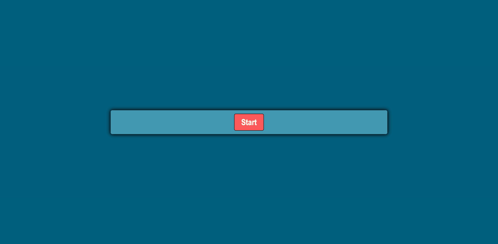
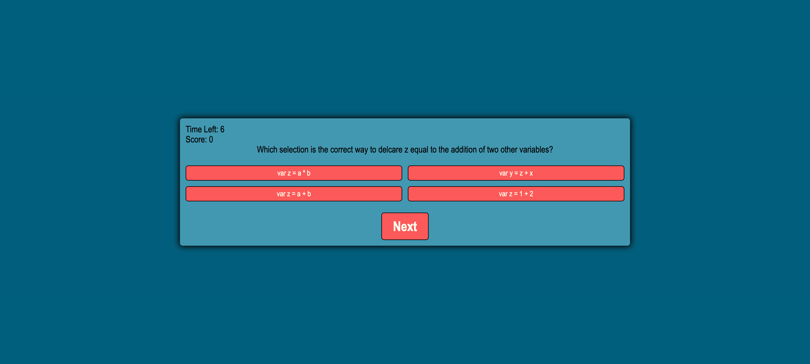
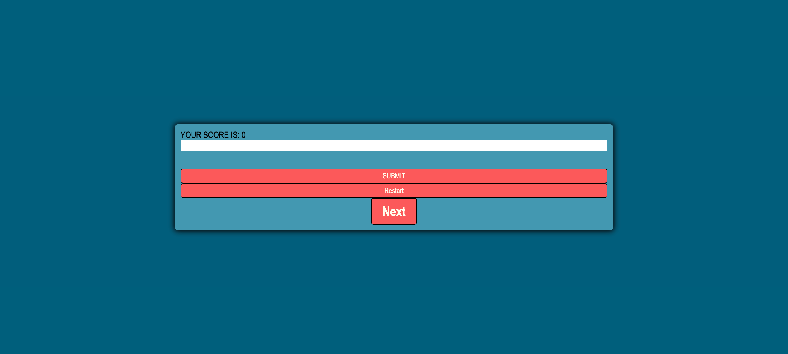
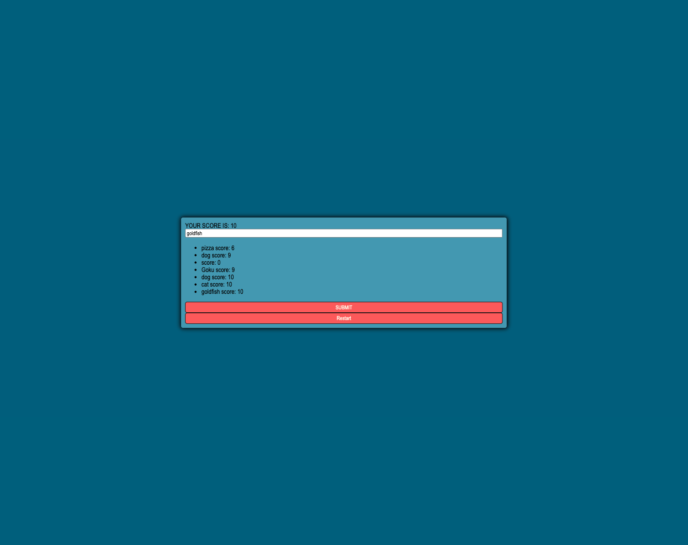
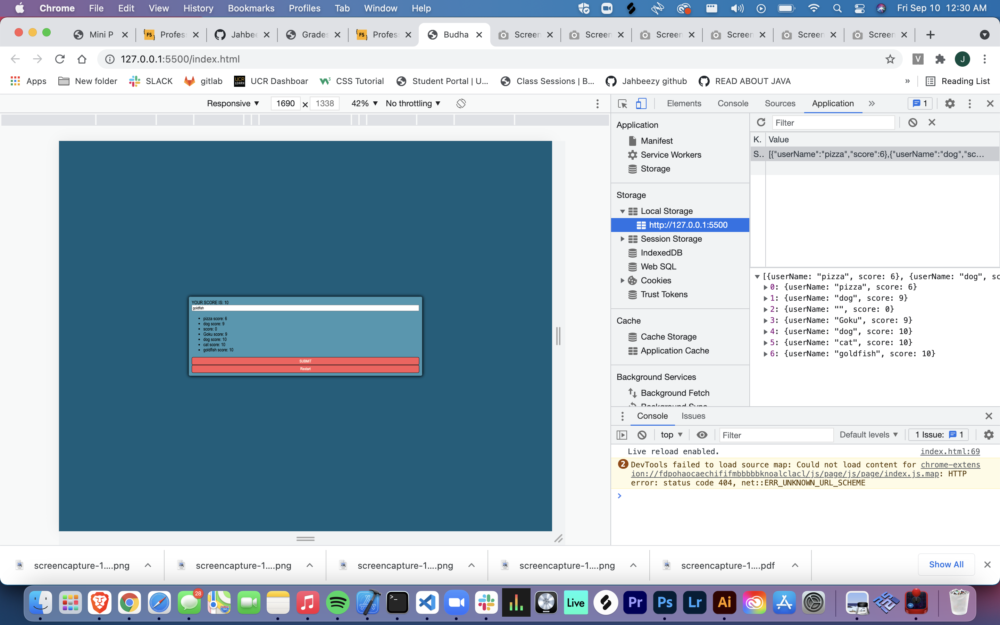

# Budha

## Description
    For this project I needed to create a timed multiple choice quiz with a scoreboard. This was a challenge in a lot of ways. I started by creating the html and css elements and design. Once that was finished the real challenge began as I began to code the JavaScript. I created a 'hide' element that allows me to hide or display the questions, start button, and end screen with java viaa seri es of .add() and .remove(). I tied event listeners to multiple functions allowing new questions to pop up at random as well as submit scores to a local storage. This project taught me a lot with over 300 lines of code. It got me to understand more of the js logic I will need to create even more complex programs.

## Installation
To install go to https://github.com/Jahbeezy/Budha and select the green code button. Copy the ssh and use get clone to clone the repository to your computer.

## Usage
* Go to https://jahbeezy.github.io/Budha/
* Click "Start"
* Select correct answers to get more time
* Wrong answers deduct time
* record your high score to local staorage

## Credits

Carlos Hernandez

Kelly Cano

https://www.youtube.com/watch?v=LQGTb112N_c&t=187s&ab_channel=MikeDane
https://www.youtube.com/watch?v=H1DUszPZakQ&t=1s&ab_channel=CodingDestination
https://www.youtube.com/watch?v=riDzcEQbX6k&ab_channel=WebDevSimplified

## Liscence

MIT License

Copyright (c) [year] [fullname]

Permission is hereby granted, free of charge, to any person obtaining a copy
of this software and associated documentation files (the "Software"), to deal
in the Software without restriction, including without limitation the rights
to use, copy, modify, merge, publish, distribute, sublicense, and/or sell
copies of the Software, and to permit persons to whom the Software is
furnished to do so, subject to the following conditions:

The above copyright notice and this permission notice shall be included in all
copies or substantial portions of the Software.

THE SOFTWARE IS PROVIDED "AS IS", WITHOUT WARRANTY OF ANY KIND, EXPRESS OR
IMPLIED, INCLUDING BUT NOT LIMITED TO THE WARRANTIES OF MERCHANTABILITY,
FITNESS FOR A PARTICULAR PURPOSE AND NONINFRINGEMENT. IN NO EVENT SHALL THE
AUTHORS OR COPYRIGHT HOLDERS BE LIABLE FOR ANY CLAIM, DAMAGES OR OTHER
LIABILITY, WHETHER IN AN ACTION OF CONTRACT, TORT OR OTHERWISE, ARISING FROM,
OUT OF OR IN CONNECTION WITH THE SOFTWARE OR THE USE OR OTHER DEALINGS IN THE
SOFTWARE.